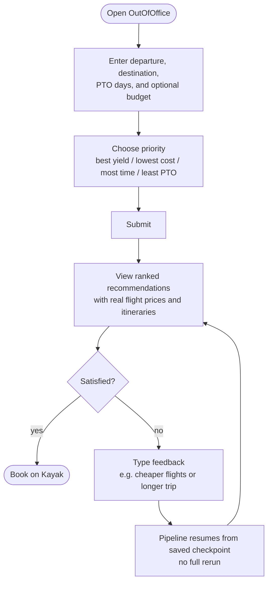
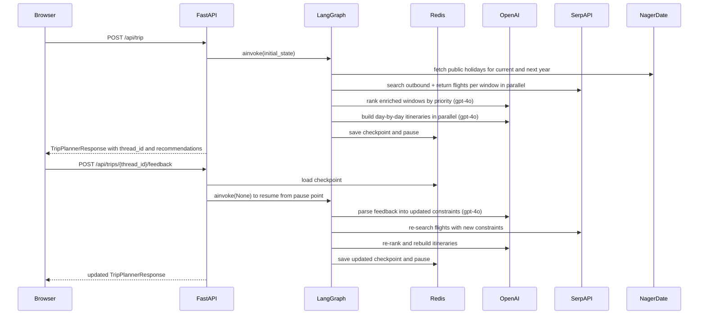
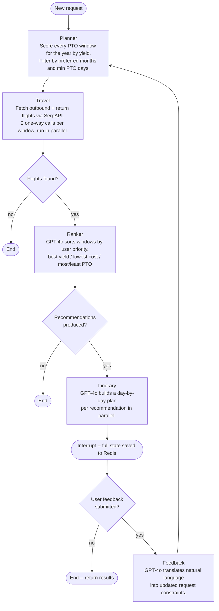

# OutOfOffice

AI-powered trip planner that finds where your PTO goes furthest. Enter your days off, destination, and budget. OutOfOffice scores every possible window, prices real flights, and returns ranked itineraries you can book in one click.

## Preview

| Trip Planner | Results | Expanded Trip | Refine Results |
|:---:|:---:|:---:|:---:|
|  |  |  |  |

## Tech Stack

**Frontend**

    

**Backend**

    

**Infrastructure**

   

## How it works







The backend is a FastAPI service orchestrating a five-node LangGraph state machine. `planner` scores every valid PTO window in the year by yield ratio (total days off divided by PTO used) and filters by the user's month and minimum-day preferences; `travel` fans out concurrent SerpAPI requests — two one-way calls per window, because SerpAPI has no round-trip endpoint — and attaches the cheapest pairing to each window; `ranker` sends enriched windows to GPT-4o for priority-aware ranking, and `itinerary` generates day-by-day plans in parallel for each recommendation. After `itinerary` completes, LangGraph pauses with `interrupt_after` and checkpoints the full graph state to Redis; the `/feedback` endpoint later loads that checkpoint and resumes execution from the pause point, so only `feedback -> planner -> ... -> itinerary` re-runs rather than the entire pipeline. Redis also backs the slowapi rate limiter, keeping both the checkpoint store and per-IP counters on a single external dependency.

## Running it locally

```bash
cp .env.example .env   # fill in SERPAPI_API_KEY and OPENAI_API_KEY
docker compose up
```

| Service  | URL                   |
|----------|-----------------------|
| Frontend | http://localhost:5173 |
| Backend  | http://localhost:8000 |

## Running tests

```bash
# Backend
cd backend
python -m pytest
```

```bash
# Frontend
cd frontend
npm test
```

## Deploying

The frontend deploys to Vercel and the backend to Render. Both auto-deploy on push to `main`.

**Frontend — Vercel**
1. Import the repo; set root directory to `frontend/`
2. Add environment variable: `VITE_API_BASE_URL` = your Render backend URL (set after step 2)

**Backend — Render**
1. Create a Web Service; set root directory to `backend/`, Dockerfile path to `./Dockerfile`
2. Create a Redis instance; copy its internal connection string to `REDIS_URL`
3. Set environment variables: `OPENAI_API_KEY`, `SERPAPI_API_KEY`, `REDIS_URL`, `CORS_ORIGINS` (your Vercel URL)
